# Сеть ветеринарных клиник. Реализуется база данных учета заказов сети клиник.
## Функциональные требования:
### Аналитические:
*	Отчет по продажам
*	Отчет состояния заказ
*	Вычисление итоговой стоимости 
*	Вычисление процента от продаж сотрудникам
*	Подсчет статистики по заболеваниям
### Оперативные:
*	Показ состояния приема
*	Показ лекарственных средств
*	Покупка лекарственных средств
*	Подробная информация о болезни 
*	Запись на прием
*	Отмена приема
### Плановые:
*	Уведомление о скидке в день рождение 
*	Уведомление о скидки в праздники
*	Отсылка месячного отчета на почту
*	Отсылка квартального отчета на почту
*	Уведомление о повторном приеме
### Транзакционные:
*	Добавление заказа
*	Отмена заказа
*	Добавить болезнь
*	Изменить лекарства
*	Изменить болезнь

## Нефункциональные требования:  
Будут две версии приложения: Мобильная и web. В этих приложениях можно будет записать на прием в одну из ближайших клиник. Запись производится зарегистрированными пользователями. Так же будет Админ-панель, в котором можно увидеть полную статистику клиники и других филиалов, а так же отчеты по продажам лекарственных средств.
 
## Связи
*   Сотрудник имеет должность
*   Сотрудник оформляет прием к врачу
*	Клиент создает прием
*	Клиент имеет животное
*	Прием хранит животное
*	Животное имеет болезнь и состояние
*	Болезнь имеет лечение
*	Лечение требует(имеет) лекарства
*	Филиал имеет сотрудников

# Логическое проектирование
### ER диаграмма

### Логическая схема

#### Заполнение базы данных

# База данных одногруппника
#### Сгенерированная ER диаграмма

#### Оригинал

### Скрипты к 3 лабораторной работе
Все скрипты представленный в папке scripts
* /scripts/lab3_db.sql - создание базы данных
* /scripts/lab3_fix_db.sql - alter table
* /scripts/lab3_delete_db.sql - удаление базы данных

#### Скриншоты работы

## Результаты работы EXPLAIN
До добавления индексов время выполнения 5 сложных запросов составило 0,613 секунд
### Схемы вызовов
1. 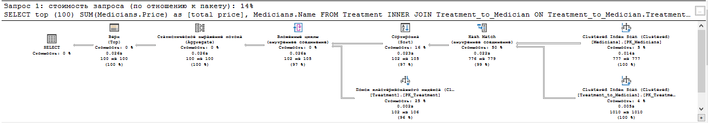
1. 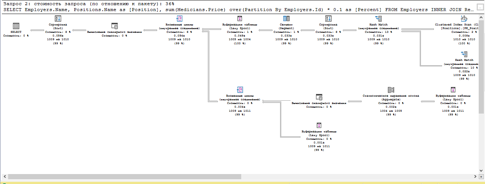
   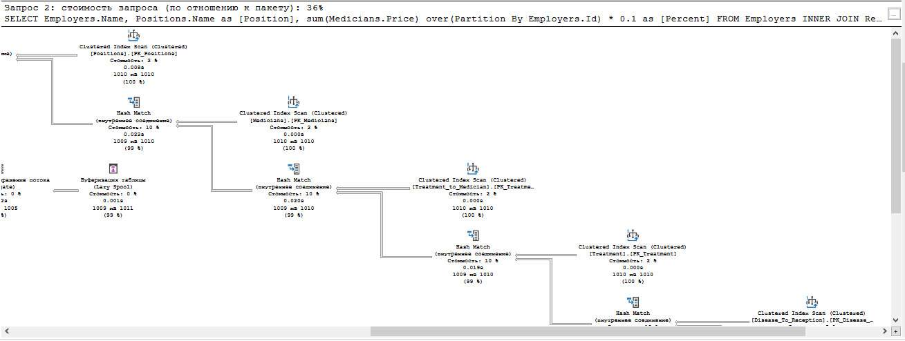
   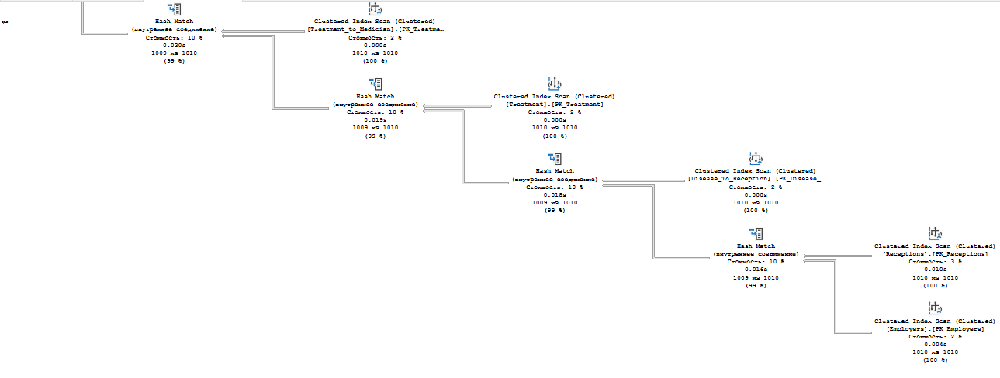
1. 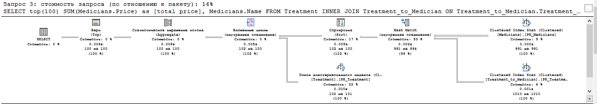
1. 
1. 
Подробнее с планами можно ознакомится в папке /plans
   После добавления индексов время исполнения тех же 5 запросов составило 0,217 секунд
   Скорость обработки увеличилась примерно в 3 раза
### Схемы вызовов
1. 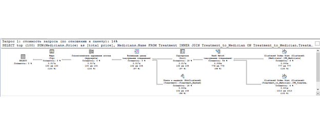
1. 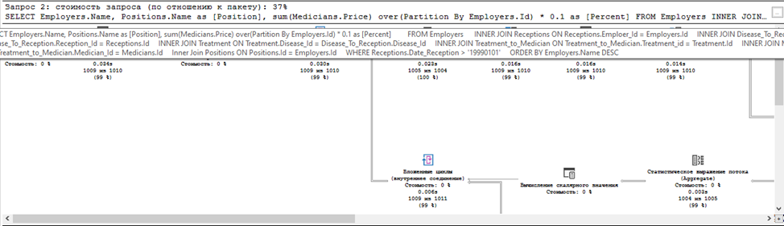
   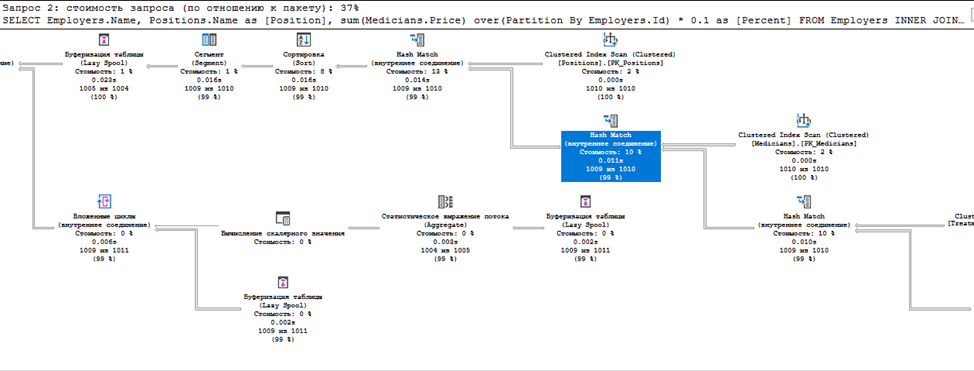
   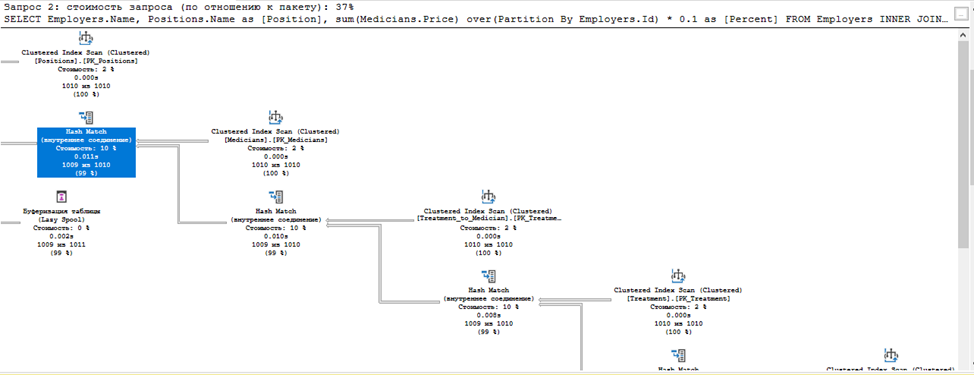
   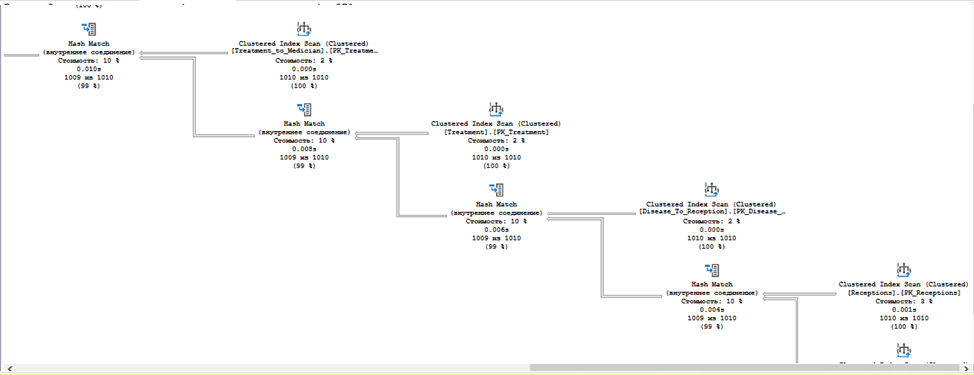
   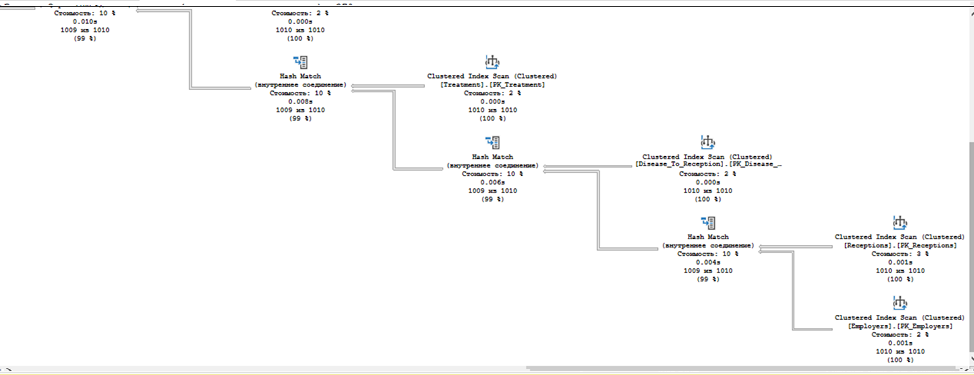
1. 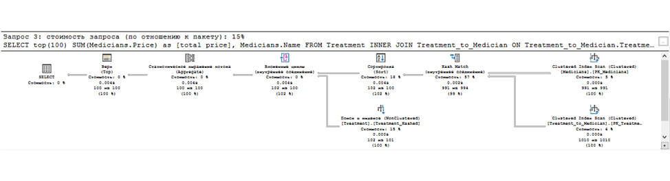
1. 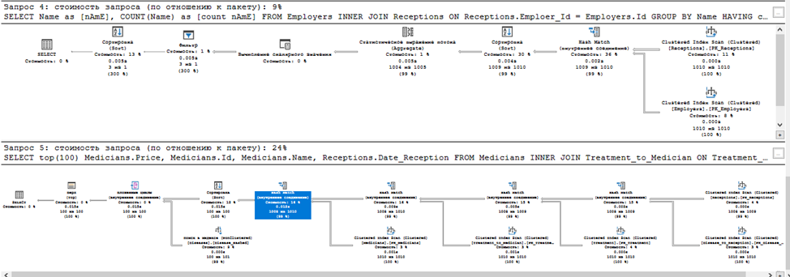

## Остальные скрипты
Остальные скрипты 5 работы лежат в /scripts/lab_5.sql
5 сложных функций лежат в /scripts/top3_hard_queries.sql

## Реализация 
Реализация лежит в папке webapp
Написано на языке php
Для связи с базой данных использовался класс PDO